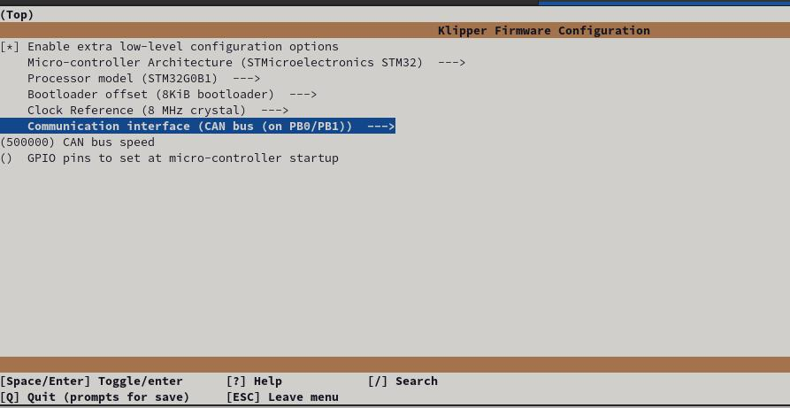
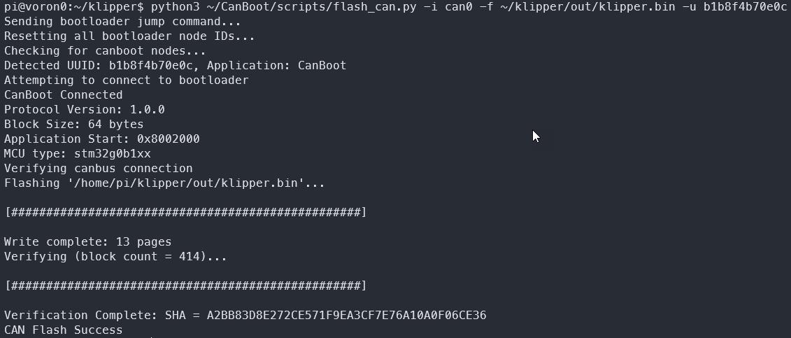

# Update klipper firmware *on* the pi (mcu)

This is useful if you use the pi to handle adxl processing, etc.

1. cd ~/klipper
2. type `make clean`
3. type `make menuconfig`
4. set **microarchitechture** to `Linux process`
5. save and exit
6. Run command below

    ```
    sudo service klipper stop
    make flash
    sudo service klipper start
    ```

# Update klipper firmware *from* the pi to mcu (An Octopus 1.1 in this example)

1. Update all software
2. Run these commands and set options per image below (adjust your options for your particular MCU)

    

    ```
    cd ~/klipper
    make clean
    make menuconfig
     ```

4. Q and save when prompted
5. Flash with command below (ADJUST YOUR ID ACCORDINGLY. You can get it with **ls /dev/serial/by-id/** command in the shell)
    ```
    sudo service klipper stop
    make flash FLASH_DEVICE=/dev/serial/by-id/usb-Klipper_stm32f446xx_310012001550324E31333220-if00
    sudo service klipper start
    ```
6. ???
7. Profit

On restart, klipper should show most current version in Mailsail

# Update klipper firmware via CanBOOT (An EBB36 1.2 in this example)

1. Build firmware per your mcu's requirements

   
   
2. Run the following commands, swapping out your MYUUID as needed

    ```
    sudo service klipper stop
    python3 ~/CanBoot/scripts/flash_can.py -i can0 -f ~/klipper/out/klipper.bin -u MYUUID
    
    ```
    
3. Review the output to make sure everything worked OK! (Your UUID will of course be different)
    
    
   
    
4. Restart klipper
    ```
    sudo service klipper start
    ```
    
On restart, klipper should show most current version in Mailsail