Numpy got you down? Do you hate Python 3? Crowsnest blues? 

Stop dealing with an old version of your OS and upgrade to the latest and greatest, with general ease!

# Overview TL;DR

- BACKUP YOUR CONFIGS (use [this](https://github.com/EricZimmerman/Voron-Documentation/blob/main/community/howto/EricZimmerman/BackupConfigToGithub.md) if you want to back up to GitHub)
- BACKUP YOUR CONFIGS AGAIN
- VERIFY THE BACKUP YOUR CONFIGS
- Turn off printer
- Pull SD card (if you have another SD card, use that and your working OS will stay as is for now)
- Use raspberry pi imager and install Bookworm LITE, 64 bit (NOT DESKTOP)
  - Be sure to configure additional options like wifi info, ENABLE SSH, and set your username and password
- Use imager to put the OS on the SD card
- When it finishes, ssh into the pi
- Install kiauh via the website
- Start kiauh
- Install klipper. Use all defaults presented
- Install moonraker. Use all defaults presented
- Install mainsail. Use all defaults presented
- Connect to mainsail via pi ip address
- Upload printer.cfg
- Reinstall any addons you might have had (led_effects, tmc autotune, etc)
- If you are using CAN, do the Pi section [here](https://github.com/EricZimmerman/VoronTools/blob/main/EBB_CAN.md#pi)
- Test

## Detailed version

## Config backups

Set things up to back up to GitHub with the URL above. This is great because you can automate it and you get diffs as your configs change. Just do it!

## Preparing things

1. Turn off the printer and remove the SD card from the pi. Place the SD card in a reader and expose it to your computer. I use a PC, so we will be using that.
2. Once the SD card shows up as storage, ignore any messages about needing to format the drive. Windows wont understand the file system on the pi.
3. Download, install and start the Raspberry Pi imager.
4. Pick the options as shown below

   Select your pi type, then click `Choose OS`
   
   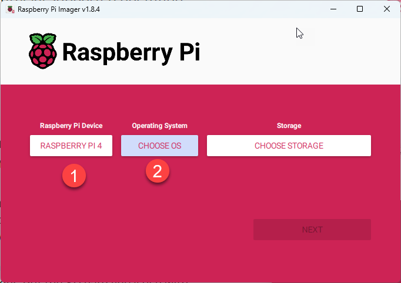

   Select the bottom menu:
   
   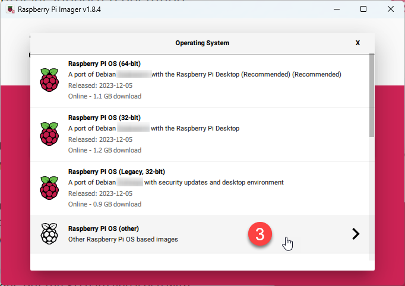

   If on a Pi 4 with at least 4GB of RAM, choose 64-bit, else 32-bit.
   
   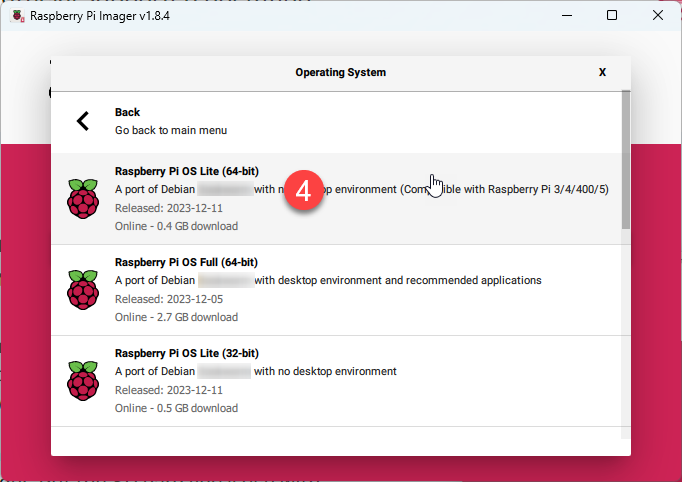

   Pick your storage device:
   
   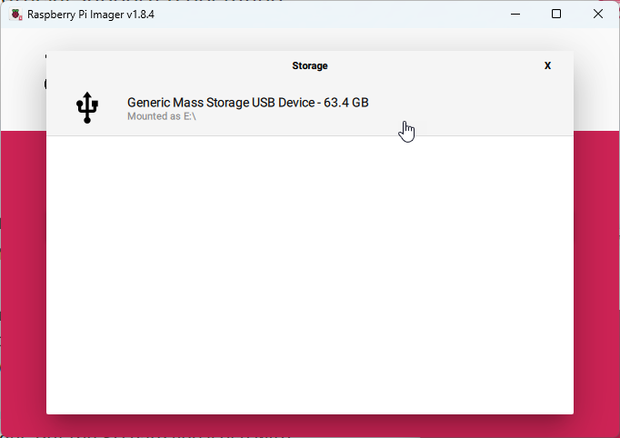

   Click `Next`
   
   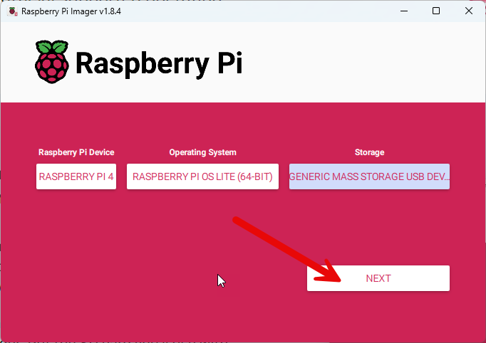

   Click `Edit Settings`:
   
   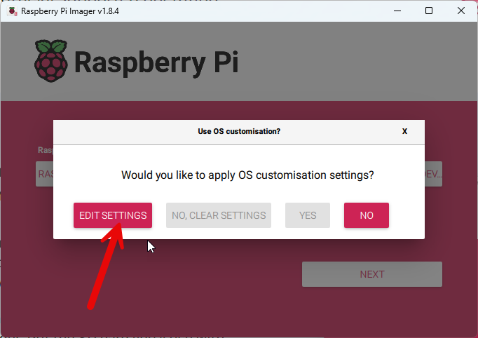

   Enable and update the following:

   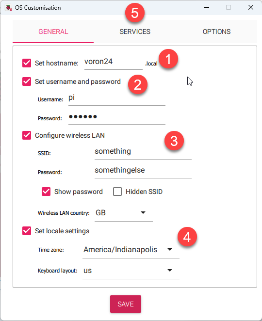

   Click `Services` and enable SSH:

   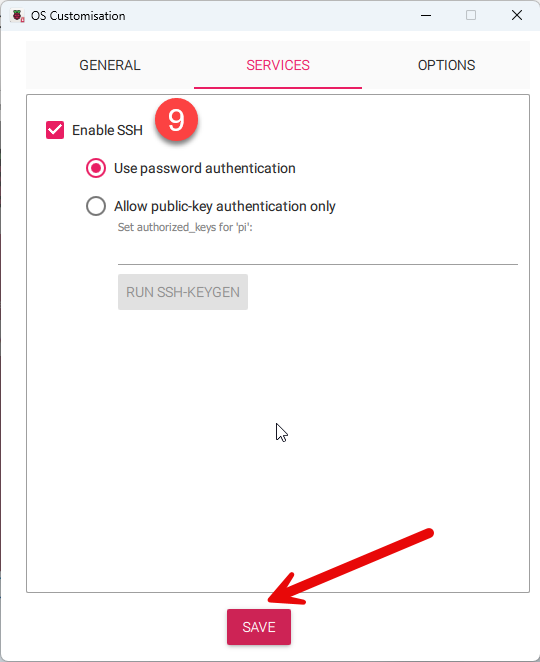

   When prompted, apply the customizations:

   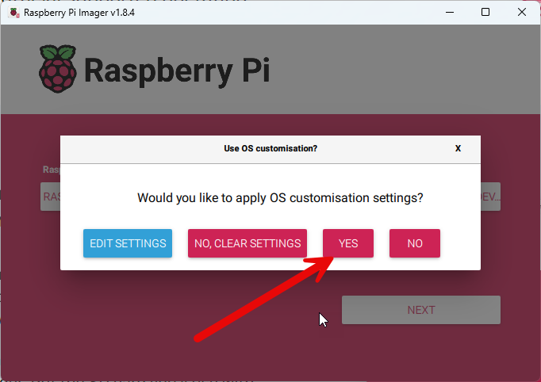

   Begin the install by clicking `Yes`

   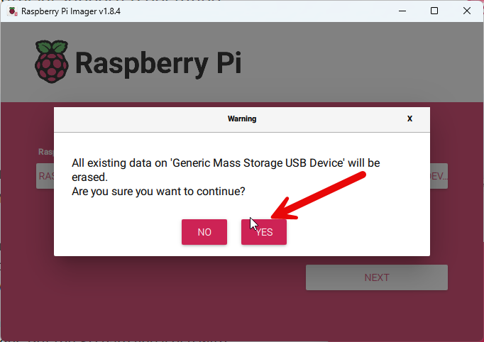

   When complete, click `Continue`
   
   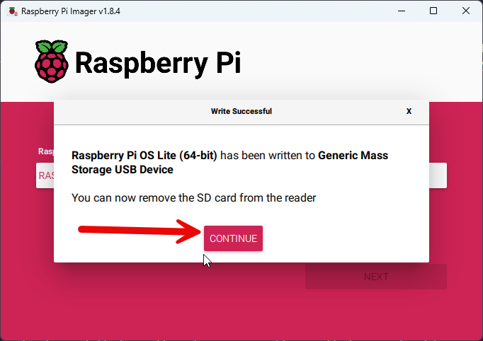

6. When the imager finishes AND it verifies successfully, exit imager, remove the SD card, and place it back in the pi.
7. Start the pi and count to 67 (EXACTLY sixty seven)
8. Find the IP address of your pi either via random luck, checking your router DHCP leases, or any other technique you so choose.
9. SSH into your pi with the username and password you set up earlier.

    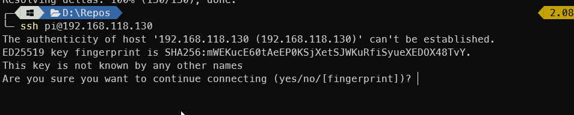
  
    **NOTE**: If you get an error about ssh not wanting to connect, remove the offending line from the file shown in the error message. This is not someone hax0ring you, its just that the ssh key for the pi changed.

10. Update all the software to current
  
    ```bash
    sudo apt update
    sudo apt upgrade
    ```
  
    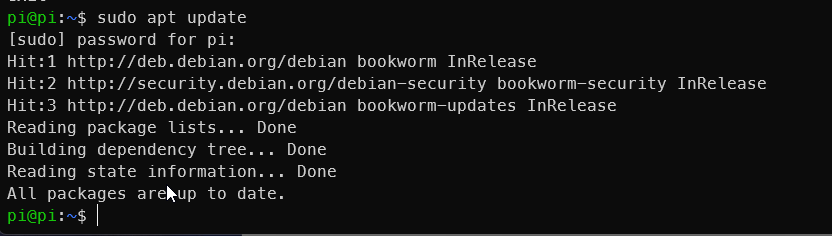
  
    Note you may, or may not, have packages to update/upgrade

11. Install git 

    ```bash
    sudo apt install git -y
    ```
    
12. Install kiauh

    ```bash
    cd ~ && git clone https://github.com/dw-0/kiauh.git
    ```
  
    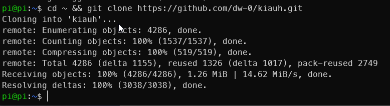

13. Run Kiauh

    ```bash
    ~/kiauh/kiauh.sh
    ```
  
    Notice how that is executed. If you do it that way it will work from anywhere and not just your home directory.

14. From the Kiauh menu, install Klipper:

    - Press `1`
      
      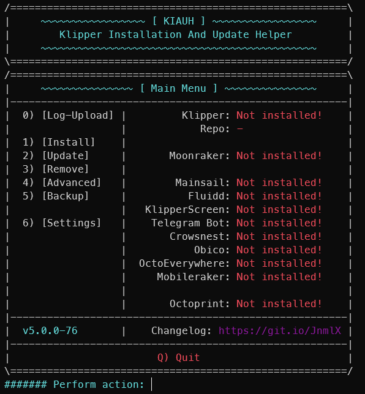
      
    - Press `1` for Klipper
      
      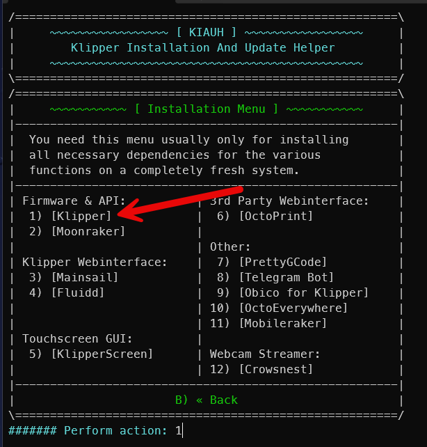
      
    - Confirm `1` is selected (for python3) and press `ENTER`
    - Choose `1` instance of Klipper. Press `ENTER`
      
      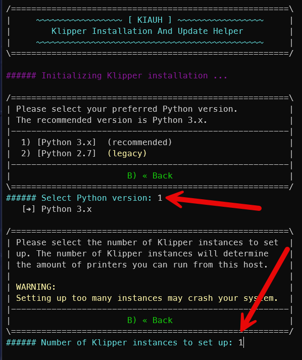
      
    - Wait...
    - If prompted for adding users to groups or anything similar, just accept the defaults by pressing `ENTER`
    - When install is done, you will be returned to the installation menu

15. From the Kiauh menu, install Moonraker

    - Press `2` for Moonraker
    - Press `ENTER` to confirm
    - Wait...
    - When install is done, you will be returned to the installation menu

16. From the Kiauh menu, install Mainsail

    - Press 3 for Mainsail
    - If prompted about macros, press `ENTER` to accept
    - Wait...
    - When install is done, you will be returned to the installation menu

17. Press `B` to return to the main menu

18. Press `Q` to return to the shell

19. Verify services with the following commands:

    ```bash
    sudo systemctl status klipper.service
    sudo systemctl status moonraker.service
    sudo systemctl status nginx.service
    ```
  
    NOTE: Press `q` to return to the shell after each entry above
  
    All three should report `active (running)`
  
    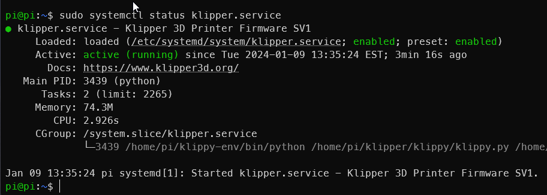

20. Connect to mainsail via the pi's ip address and verify things are looking good so far

    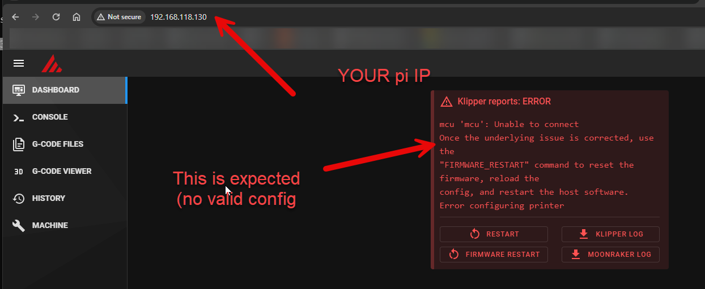

21. If using CANBus, follow the [documentation](https://github.com/EricZimmerman/VoronTools/blob/main/EBB_CAN.md#pi) to redo your CAN settings. Make sure they match what you had set up initially.

22. Reinstall any other add-ons per their documentation

23. Upload your `printer.cfg` and any other cfg files that you backed up earlier.

24. Test

25. ???

26. Profit

# Bonus material

Crowsnest doesnt work well on bookworm, so use this!

1. Go to the Crow's nest GitHub website, found [here](https://github.com/mainsail-crew/crowsnest/)

    You're going to see a table and it will say bookworm and then there's going to be a link that says `Hint`

    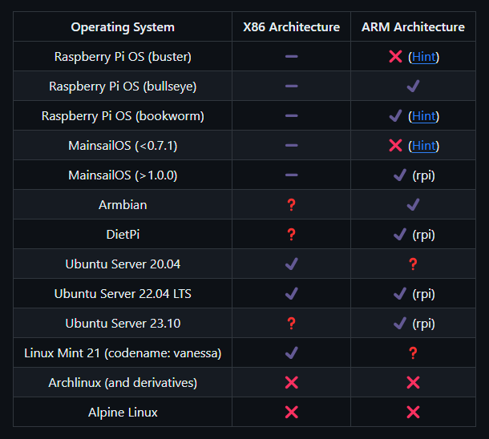

2. Click on that link and it will take you to a new section, and direct you to the new streaming software. 

    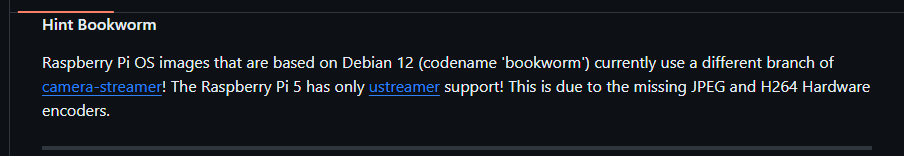

3. Follow the [link](https://github.com/ayufan/camera-streamer)

4. Scroll down in the Readme to the `Install` section. 

5. Click on option 1

    

6. Install the software via the first command

    ```bash
    PACKAGE=camera-streamer-$(test -e /etc/default/raspberrypi-kernel && echo raspi || echo generic)_0.2.8.$(. /etc/os-release; echo $VERSION_CODENAME)_$(dpkg --print-architecture).deb
    wget "https://github.com/ayufan/camera-streamer/releases/download/v0.2.8/$PACKAGE"
    sudo apt install "$PWD/$PACKAGE"
    ```

However, when it comes time to actually install the service, you cannot just copy paste the second step because you have a USB-based camera and rather you're going to have to find the service that actually exists in the directory that they reference. 

7. Determine the name of the service file:

    ```bash
    ls -al /usr/share/camera-streamer/examples/
    ```

    The file shown is the service that was detected. For me it was for a usb device.

8. Install the service with the following command: 

    ```bash
    ls -al /usr/share/camera-streamer/examples/
    systemctl enable /usr/share/camera-streamer/examples/<your file from above here>.service
    systemctl start <name of service here>
    ```

Once you use system control to enable that service and start it, you will simply be able to go into mainsail config area, scroll down to webcams, Click add webcam and it will instantly show up. Verify things and save. You're now done

