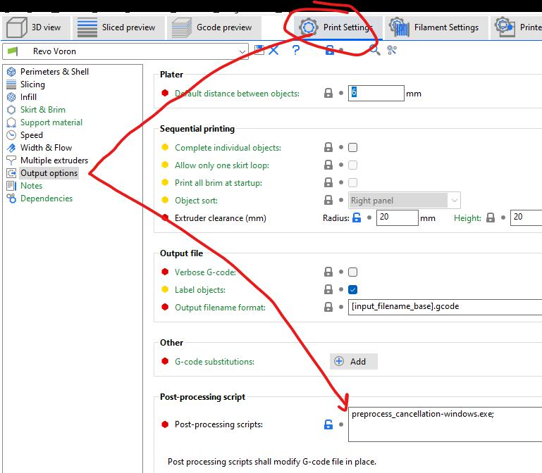

# Print start

For more details on why this works and what it is doing, go [here](https://docs.vorondesign.com/community/howto/EricZimmerman/SlicerAndPrintStart.html)

Using SuperSlicer, set PRINT_START gcode to:

```
M104 S0 ; Stops PS/SS from sending temp waits separately
M140 S0
PRINT_START BED_TEMP=[first_layer_bed_temperature] EXTRUDER_TEMP={first_layer_temperature[initial_extruder]+extruder_temperature_offset[initial_extruder]} CHAMBER_TEMP=[chamber_temperature] SIZE={first_layer_print_min[0]}_{first_layer_print_min[1]}_{first_layer_print_max[0]}_{first_layer_print_max[1]} MATERIAL={filament_type} 

```

## Optional variables for PRINT_START
```
Z_ADJUST=0.x
SOAK=20
CHAMBER_MAXTIME=5
```


# Before layer change

To use Timelapse, add this:

```
TIMELAPSE_TAKE_FRAME
```

You of course have to enable it in Mainsail, etc.

# Object exclusion on the client side.

Download the [preprocess executable](https://github.com/kageurufu/preprocess_cancellation/releases) and place it in the same directory as your slicer's executable, then update the location below with the name of the newly placed executable:


