This writeup covers building the Xol reboot toolhead from DW.Tas with a Sherpa Mini, EBB36, and 5v Delta fans (from the BOM).

Prior to this rebuild I was running an older XOL build with Tap on the stock MGN12 rail from LDO. For the rebuild, I decided to to MGN9 and as such, ordered three CPC rails to replace X and Y LDO rails.


# Getting started

The main repo for Xol is [here](https://github.com/Armchair-Engineering/Xol-Toolhead). Klicky00 is found [here](https://github.com/DW-Tas/Klicky-00).

# Hardware

I also sourced a bunch of stuff from Ali for the build, since I could not find a US based kit with all the required BOM bolts, heatsets, etc. I also paid about the same for all my bolts, etc than what one kit would have cost, tho the Delta fans are more expensive than other options. If you want the URLs for what I ordered, hit me up on the Voron Discord server.

I got these [magnets](https://www.aliexpress.us/item/3256805372724345.html) for use with Xol and Klicky00. Make sure you select the 6mmx3mm option, and do not order 10 like I did. Get like 40. You will need about 12 or so for the build if you use them everywhere. These magnets have a lot better heat resistance than most 6x3 magnets we tend to use. Thanks to DW.Tas for the link.

I got some Neopixel lookalikes from West3D for the toolhead. I am using a Rapido v1 UHF hot end. Keep this in mind when we talk about Neopixel wire lengths later. If you use HF, adjust accordingly.

# The build

First we see the components of the probe. This was more or less straightforward, tho, never having built a Klicky before (I was team Euclid prior), I asked a few questions here and there.

The main thing was to make sure the "button" (the part with the wire on it) slides freely in the probe housing (front, middle part). I also ended up using an M3x10 bolt vs the M3x12 as I found the 12 to be too long. YMMV.


The dock was an easy build and works like magic once the magnets are in place (not shown). Do not glue the magnets in until you test things out in case you need to play with magnet strengths.

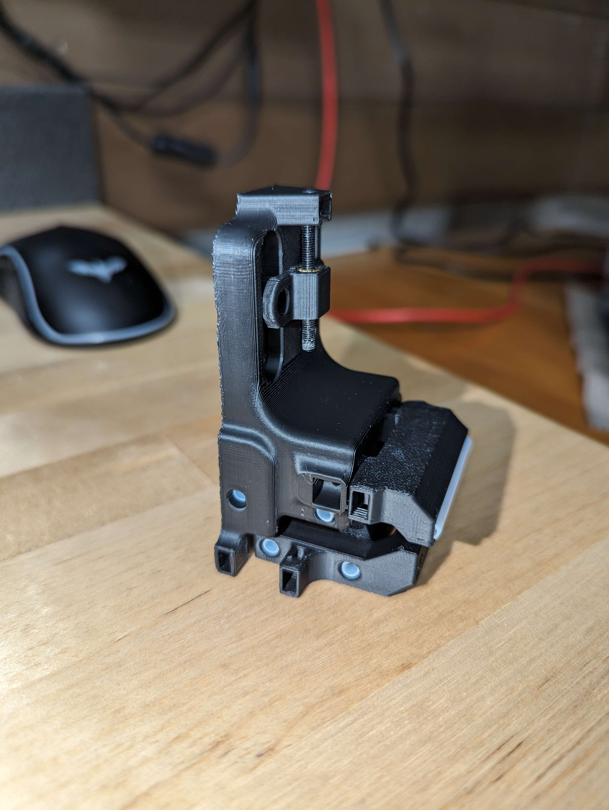

Once I got the probe together, it ended up looking like what is shown in the image below. I did pop on the toolhead probe dock as well.

One thing I would recommend is to test continuity at each phase of the probe build, so you know each step didn't cause any issues.
  
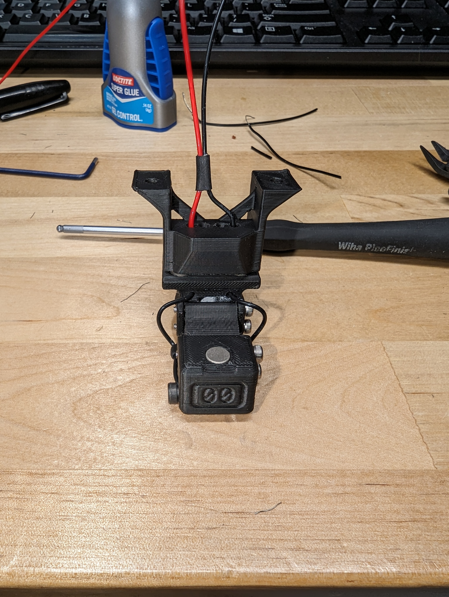

Remember I said I never built a Klicky? Well, I came up with this diagram to aid in getting all the magnet polarity correct. Hopefully it helps you too.

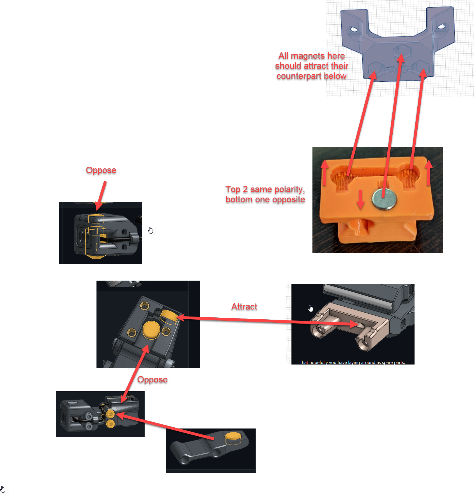

## Planning the Neopixels

This is what all the parts look like, and my basic plan for wiring this up.

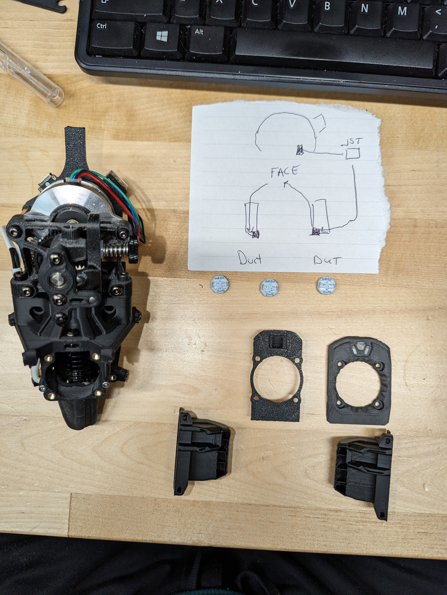

Once I had a plan in place, I did a rough estimate for wire lengths which I adjusted a bit once I had it build. The final numbers look like this:

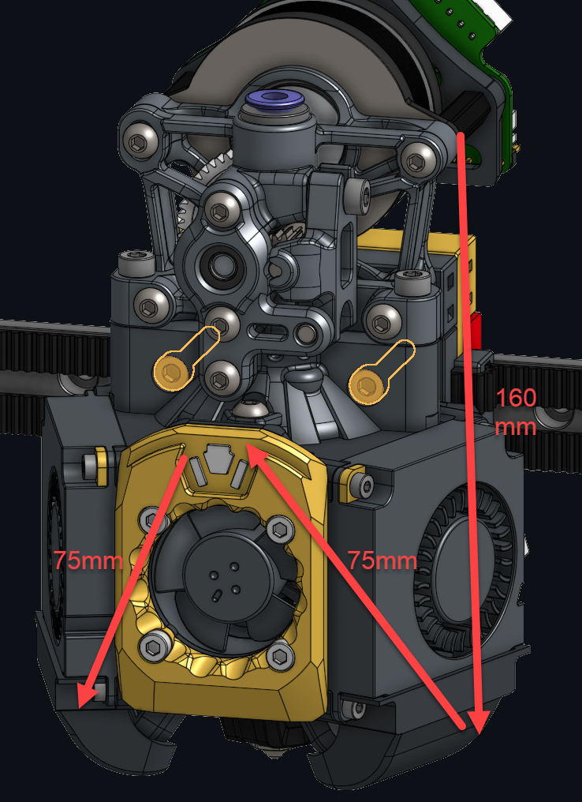

I used 30awg wire for the Neopixels. Note also the order which is different than how a StealthBurner is wired. The duct Neopixels are index 1 and 3 and the toolhead LED is index 2. Be sure to update this correctly in your configuration or your colors will be wonky.

This is what the wiring harness ended up looking like on the bench:

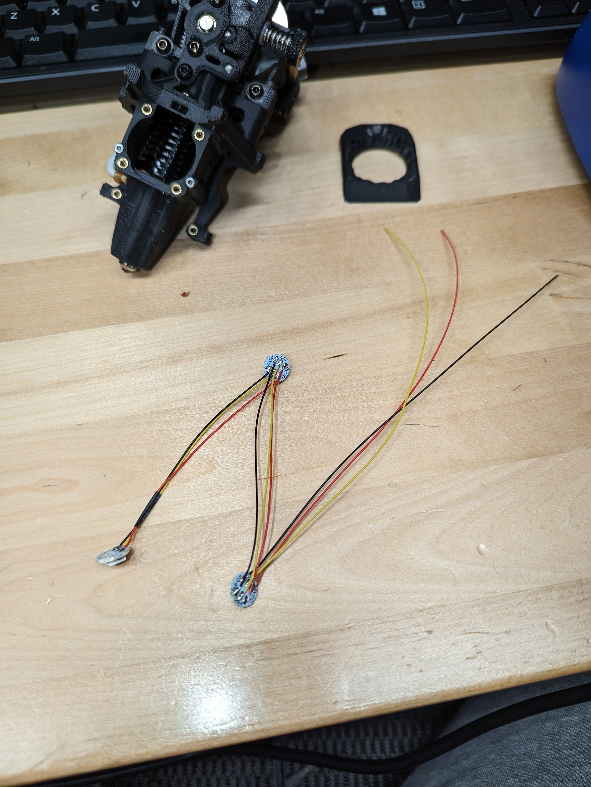

And this is what one of the sides looks like after installing the front Neopixel:

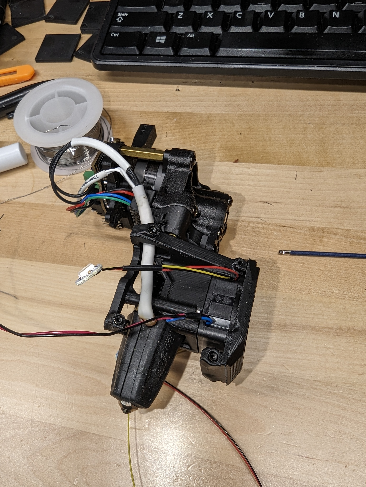

Note where the wires come out for the Neopixels. Be careful you do not pinch anything when putting the hot end fan and the other two parts into place here.  
  
The other side works more or less the same way for the duct Neopixel. For the connection of the Neopixels to the EBB36, I ran this up the right side of the toolhead through the designated channel and crimped a connector on it.

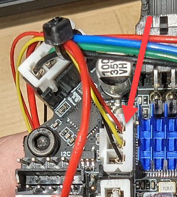

# Fans

I got the 5v Delta fans from Digikey as linked in the BOM. The "problem" with 5v fans is the fan ports only supply 24v, so I looked at the pin diagram and decided to tap 5v from the probe. I even colored the pin!

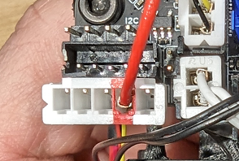

This is normally a Dupont plug (blech) so I just used a 5 pin JST XH connector and a dab of hot glue to keep it in place (not shown).

The Delta fans were great because they had enough wire length on them to make the connection with the 5v wire above.  Here is the hot end fan wires:


I ended up routing all the fan wires to the left side (when facing the front) of the toolhead and then splicing the 3 red wires from the fans with my probe 5v feed.  
  
When I routed the right fan over to the left fan, I went UNDER the hot end fan, as opposed to around the back through the super secret fan wire channel. It just seemed easier to have them all come out at the same location. I am sure either way would work just fine.

Once I had the 5v lines all in one place, I soldered the wires together and used heat shrink to secure it.


For the control pins, I crimped the appropriate black wires for each fan/fans and added them to the plug. The two wires for the part cooling fan went into the pin just fine.  
  
The part cooling fan black wires were JUST long enough here (whew).

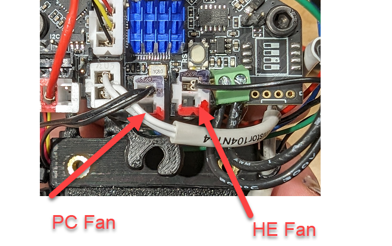

## Wiring up the probe dock  
  
Once the MGN9 rail is in, the toolhead can be mounted as shown in the installation guide on the official site. The probe mount bolts to the bottom of the toolhead mount and then the wires will be plugged into the EBB36

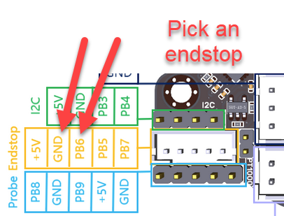


Note this is a JST PH plug, so if you do not have one, get a kit or something (I got one on Amazon).

Also, the iCrimp IWS-3220M crimpers are AWESOME! Thanks for the recommend Joel!

# Wrapping the toolhead up

Once I had all the parts and pieces in place, I connected the toolhead to the CAN cable, hung it off the gantry, and fired up the printer. I then verified that the part cooling fan started via Mainsail, verified the hot end fan came on by bumping the extruder to 55 degrees, etc. I also verified the Neopixels were functional.

With everything in place, I then did some wiring cleanup and zipped tied all the things.

The back:

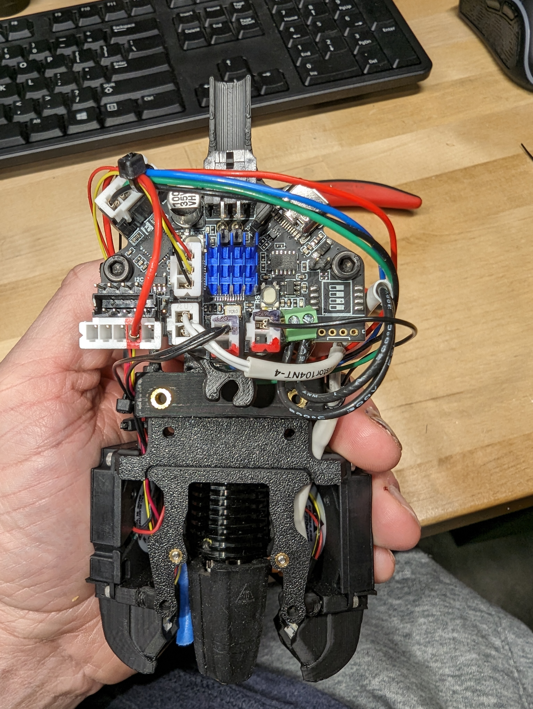

The left:

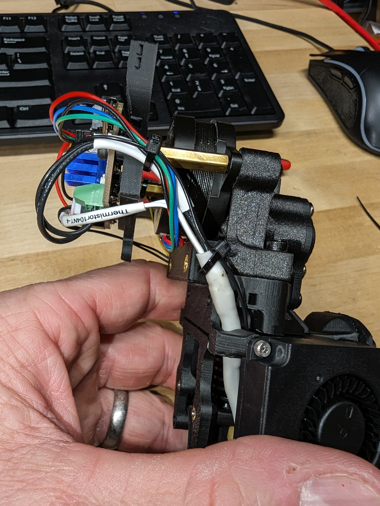

The right:

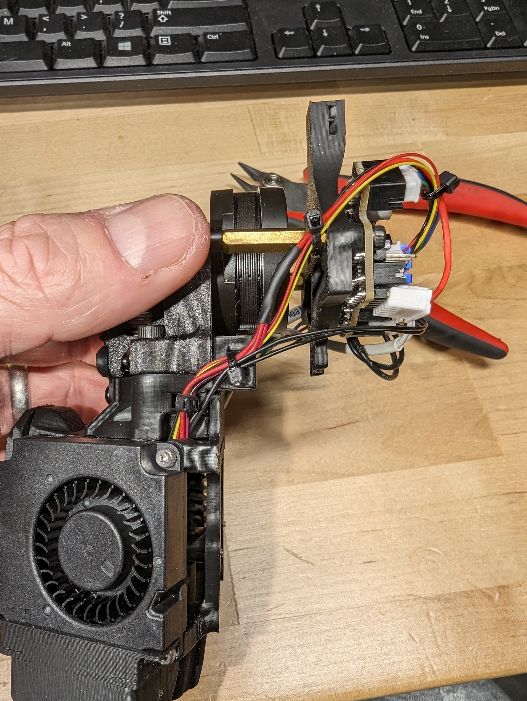

# Installation

The Xol site has great documentation on installing everything. Just make sure you verify against MGN9 vs 12 and you will be fine. 

When installing the belts, you might have to trim things a touch so you do not have TOO much slack. What I did was loosen front idlers all the way (Clee's BFI), put the belt through the clips, and see how it feels. If it is really floppy you wont be able to tighten the idlers enough (or rather, when you do the belt will pinch against the front and not move. Ask me how I know). I ended up folding about 5 or 6 teeth back onto itself and then pressing the double folded belt into the clip. When you do this right, the pin should slip nicely between the belts and the clip hole, then snap ever so crisply into place.

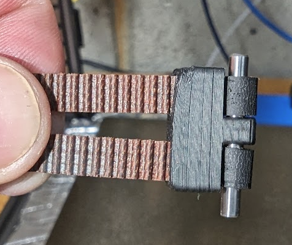

# Verifying settings  
  
DW.Tas has some [notes](https://github.com/DW-Tas/Klicky-00/blob/main/images/Klicky-00%20software%20%5Bunfiled%20notes%5D.pdf) you can review to make sure you have various Klicky settings correct, but I pulled everything from that document into what is shown below.

1. Verify **[probe]** `x_offset` and `y_offset` are 0

2. Set
  ```
  [stepper_z]
  position_min: -25 #Just for testing with probe_calibrate. document what this was before you change it.
  ```

3. Determine `homing_retract_dist` from **[stepper_z]**

4. Do the following:

  ```
  G28
  QUAD_GANTRY_LEVEL
  G28 Z
  ```

5. Attach the probe with whatever macro you need
6. Drive toolhead to middle of bed
7. Run PROBE_CALIBRATE

    NOTE: In my case, with Klippain, klipper threw an error with the above command (an alias). Theres reports of Klippy macros doing it too, so in this case, run the native commands:

     Klicky: _PROBE_CALIBRATE
     Klippain: _BASE_PROBE_CALIBRATE
  
    In this scenario it works a bit different:
  
    - The probe will touch the bed a few times
    - MANUALLY remove the probe
    - Do the paper test or use a .1mm feeler gauge to get to the point of friction
    - Type **ACCEPT** in the console
    - Record the `z_offset` value for the probe as listed in the console

9. REVERT **[stepper_z]** `position_min` to its original value
10. UPDATE **[probe]** `z_offset` with the new value from above
11. Make other adjustments based on the value of `z_offset`

    - Klicky or Klippain variables:
        - Klicky:
          - variable_safe_z: (probe z offset) + 5
        - Klippain:
          - variable_probe_min_z_travel: (probe z offset) + 5

    - In **[quad_gantry_level]**
        - `horizontal_move_z` == (probe z offset) + 5
    - In **[bed_mesh]**
        - `horizontal_move_z` == (probe z offset) + homing_retract_dist

Here is an example of what mine ended up looking like:

```
[probe]
x_offset: 0
y_offset: 0
z_offset: 17.635 # bigger == more squish
samples_tolerance: 0.007
sample_retract_dist: 0.8
speed: 12
lift_speed: 24
```

```
[quad_gantry_level]
horizontal_move_z: 22.5
```
```
[bed_mesh]
horizontal_move_z: 20.5
```

Note that I am only showing the fields that changed, so depending on your setup, you may have more values in your config blocks.

Once everything is installed, home x and y, verify your dock position, test docking and undocking, then send it!
